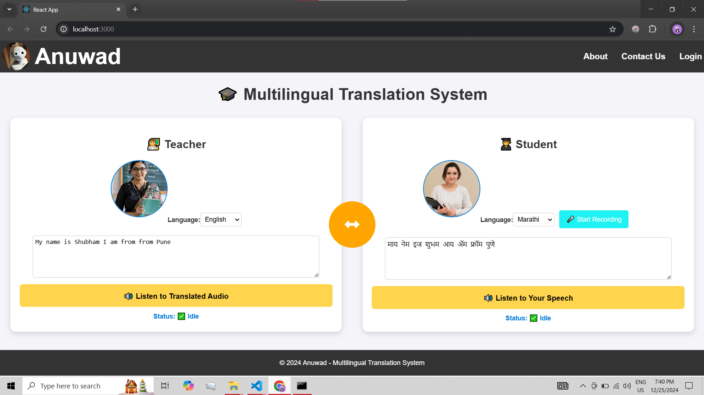

# 🌐 **Anuwad: Transforming Regional AI Translation** 🤖

## 📝 **Problem Statement**
Language barriers limit communication across languages, affecting collaboration and access to information. **Anuwad** aims to solve this by:
- Converting speech to text 🎤
- Translating it into different languages 🌍
- Converting the translated text back into speech 🔊

---

## 🔑 **Key Features**

### 1. **Real-Time Speech Recognition** 🎧
- Converts speech to text using **Speech-to-Text** (STT) 📝.
- Supports various **Indian languages** (Hindi, Kannada, Marathi, etc.).
- Handles diverse **accents** and **dialects**.

### 2. **Language Translation** 🌏
- Translates text from mentor’s language to user’s native language 🔄.
- Uses **IndicTrans2** models for accurate translations.
- Fallback for unsupported languages 🛠️.

### 3. **Text-to-Speech (TTS)** 🗠️
- Converts translated text back to speech using **Google TTS** 🔊.
- Multiple voice options for a natural-sounding output 🎶.

### 4. **Bidirectional Communication** 🔄
- Allows communication in **both languages** (mentor & user).
- Toggle feature for seamless switching 🔄.

### 5. **Language Selection** 🌍
- Users select their preferred language from a list 🌐.
- **Automatic language detection** for ease ⚡.

### 6. **User Interface (UI)** 🖥️
- Simple, intuitive interface for users 👨‍💻.
- Visual cues for real-time translation and speech status 👁.
- Optimized for **accessibility** (large fonts, screen reader compatible) 💡.

### 7. **Scalability & Performance** 🚀
- Optimized for **multiple users** simultaneously 🌟.
- **Low-latency** for real-time communication ⏱️.

### 8. **Security & Privacy** 🔒
- No sensitive data storage ❌.
- **Encrypted** data transmission 🔐.

---

## ⚙️ **Tech Stack**

- **Frontend:** React.js ⚛️
- **Backend:** Flask 🐍
- **Authentication:** Firebase Authentication 🔑
- **Speech Recognition:** Webkit Speech Recognition 🎤
- **Text-to-Speech (TTS):** Google TTS 🔊
- **Translation:** IndicTrans2 Models 🌍

---

## 🖼 **Screenshot**

Here’s a glimpse of the application interface:

---

## 🚀 **Future Enhancements**

- **Offline functionality** for STT & TTS 🛲.
- Option to **save/export translated conversations** 💾.
- **Integration with messaging/video platforms** 📱📩.
- **Teacher-Student Platform Integration:** 👨‍🏫
   - Teachers will be able to **upload their audio lessons** via a login portal.
   - Students can **access lessons** in their preferred language.
   - A centralized dashboard for teachers to manage uploaded content and track engagement.

---

## 📺 **Deployed link of Anuwad**

[**Click here!** 🎬](https://anuwad-transforming-regional-ai-translation-p5v1pt5hm.vercel.app/)

---

## **Status**

### **Implemented:**
1. **Real-Time Speech Recognition**:
   - Speech-to-Text (STT) implemented.
   - Supports multiple Indian languages (Hindi, Kannada, Marathi, etc.).

2. **Language Translation**:
   - Text is translated from mentor’s language to the user’s native language.
   - Translation is handled using IndicTrans2 models.

3. **Text-to-Speech (TTS)**:
   - Converts translated text to speech using Google TTS.

4. **Bidirectional Communication**:
   - Users can communicate in both languages (mentor & user).
   - Toggle feature to switch between languages seamlessly.

5. **Language Selection**:
   - Language selection dropdown for users to choose their preferred language.

6. **User Interface (UI)**:
   - Simple, intuitive interface with visual cues for real-time translation and speech status.
   - Optimized for accessibility (large fonts, screen reader compatible).

7. **Backend & Frontend**:
   - Backend implemented using Flask.
   - Frontend developed using React.js.

8. **Authentication Pages**:
   - Firebase project created & Authentication pages completed.

---

## **Remaining Tasks:**

1. **Security & Privacy**:
   - Implement data encryption for secure transmission.
   - Ensure no sensitive data storage (currently pending).

2. **Teacher-Student Module Integration:**
   - Develop a **teacher login portal**.
   - Enable **video uploads** for lessons.
   - Build a **student interface** to access lessons in their native language.
  
3. **Deployment on Cloud:**
   - Deploy web application on Vercel Cloud Platform**.

---

## 📧 **Contact**

For further inquiries, reach out to me at:
 **Shubham Murtadak ~ AI Engineer** 📩.

---

